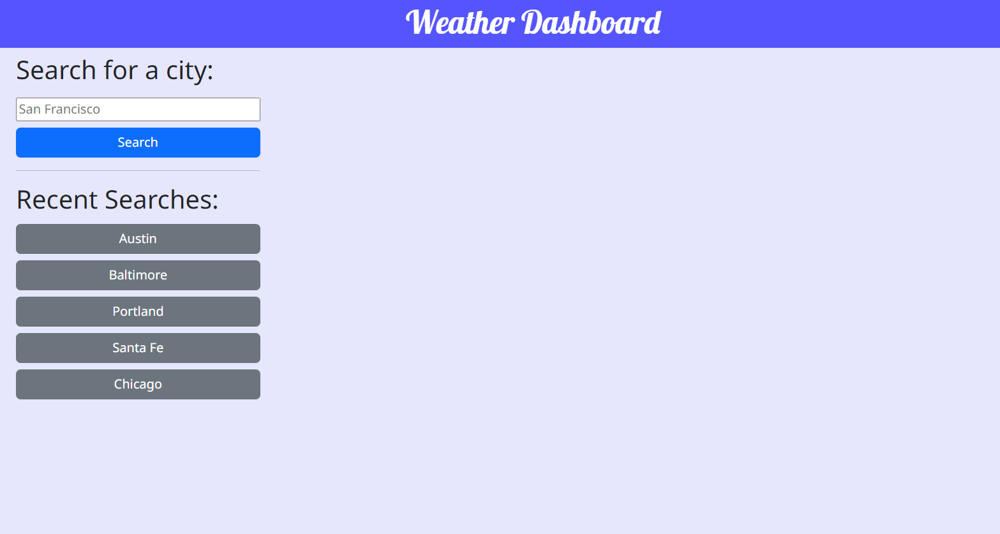
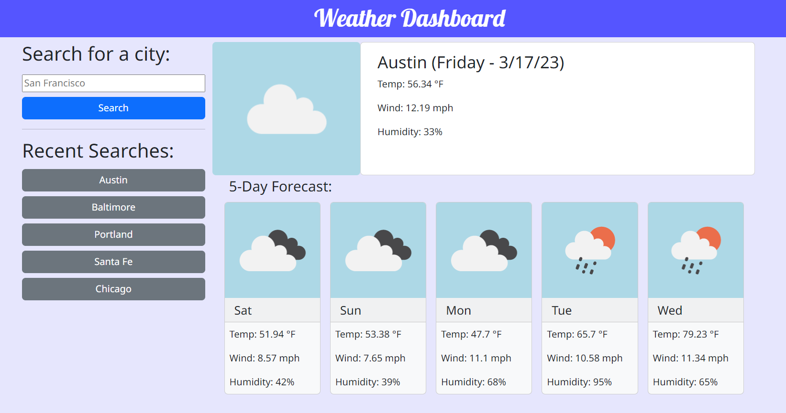

# Challenge 6 - Weather Database

## Description

This website can be used to track the weather in multiple locations.

## User Story

**AS A** traveler

**I WANT** to see the weather outlook for multiple cities

**SO THAT** I can plan a trip accordingly

## Acceptance Criteria

**GIVEN** a weather dashboard with form inputs

**WHEN** I search for a city

**THEN** I am presented with current and future conditions for that city and that city is added to the search history

**WHEN** I view current weather conditions for that city

**THEN** I am presented with the city name, the date, an icon representation of weather conditions, the temperature, the humidity, and the the wind speed

**WHEN** I view future weather conditions for that city

**THEN** I am presented with a 5-day forecast that displays the date, an icon representation of weather conditions, the temperature, the wind speed, and the humidity

**WHEN** I click on a city in the search history

**THEN** I am again presented with current and future conditions for that city

## Challenge Directives

* Uses the OpenWeather API to retrieve weather data
* Uses `localStorage` to store persistent data

## Demonstration

Website deployed at [eeast.github.io/CH6-WeatherDashboard/](https://eeast.github.io/CH6-WeatherDashboard/)

## License

Please refer to the LICENSE in the repo.
